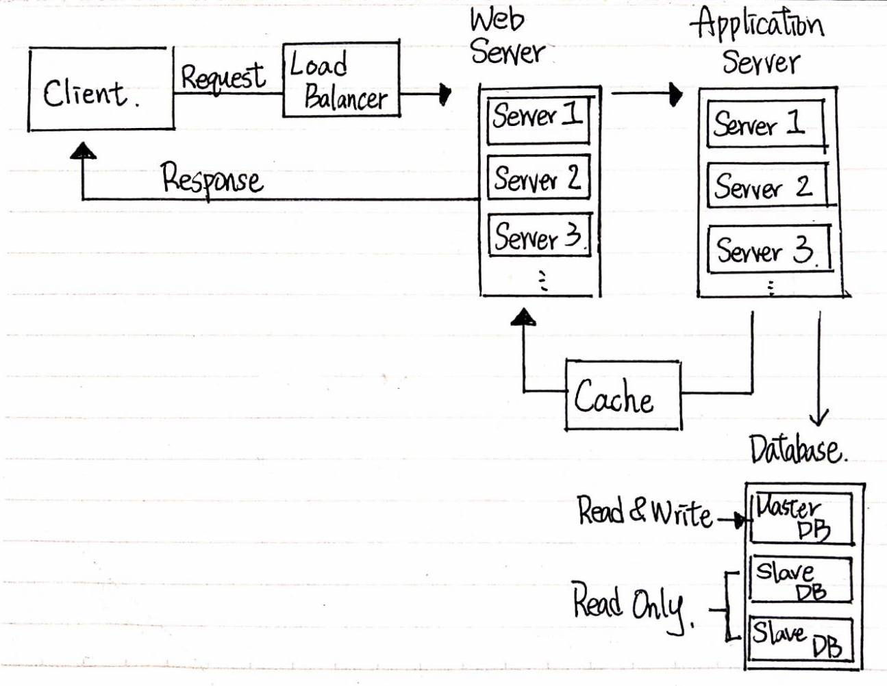

## hw1：短網址系統設計
### 後端系統架構圖：

### 實際步驟：
1. Client 發出一個帶有長網址並希望縮短成短網址的 Request 給後端
2. Load Balancer 收到 Request 之後，把 Request 分配給適合的 Web Server
3. Web Server 接收到 Request 之後把 Request 再送給 Application Server
4. Application Server 先去查詢 Database 裡面是不是已經從在這一組網址
5. 如果已經存在網址，把網址存在 Cache 裡面傳回給 Web Server，如果不存在，則產生短網址後存在 Cache 傳回給 Web Server 並同時把資料傳送到 Database 儲存，讓下次搜尋時使用
6. Web Server 收到資料之後把 Cache 裡的資料夾帶在 Response 裡面回傳給 Client